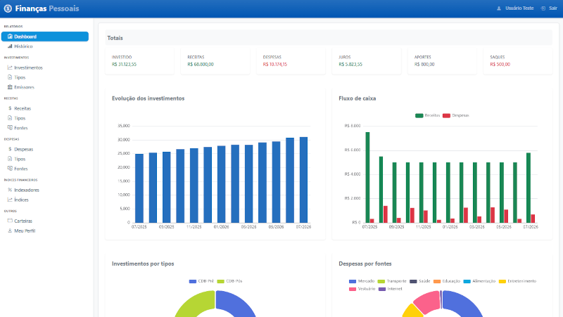
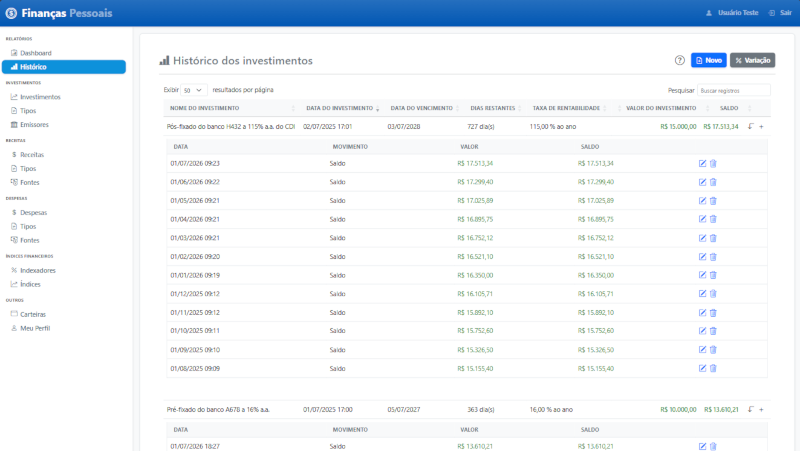
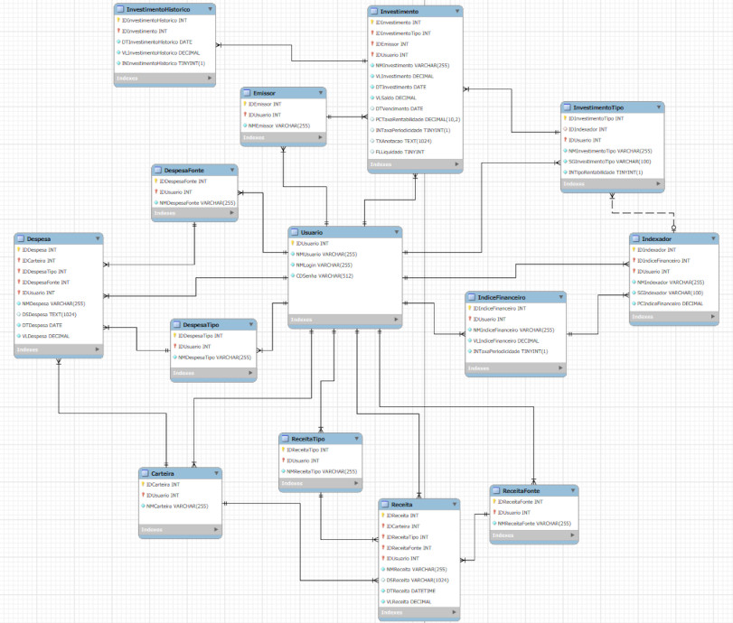

# Finanças Pessoais

## Sistema de registro e acompanhamento de investimentos e fluxo de caixa

Uma aplicação web monolítica de alta performance desenvolvida em .NET 10 para controle patrimonial, registro da evolução de investimentos com painéis visuais interativos, desenvolvido com o objetivo de demonstrar competências técnicas em padrões de engenharia e arquitetura de software do ecossistema .NET 10 e ser um **projeto estritamente acadêmico e de portfólio**.

<p>
    
    
</p>

## Características

- Histórico e evolução dos investimentos: gráficos interativos com histórico retroativo de 12 meses.

- Fluxo de caixa customizado: módulo de controle de receitas e despesas com visões consolidadas e conversão nativa para o padrão de moeda brasileiro (PT-BR).

- Segurança defensiva (antimanipulação): criptografia de chaves primárias nas URLs utilizando a biblioteca de `DataProtection` do .NET para impedir ID-Tampering (ataques de alteração de parâmetros).

- Arquitetura desacoplada: implementação baseada em Clean Architecture e Repository Pattern, garantindo isolamento total da camada de negócio em relação ao ORM (Entity Framework Core).

## Arquitetura

O projeto foi estruturado seguindo os princípios do DDD (Domain-Driven Design) e da Clean Architecture, garantindo total desacoplamento, testabilidade e isolamento das regras de negócio. A solução é dividida em 4 camadas estruturais:

- FinancasPessoais.Domain (coração do sistema): contém as entidades de domínio, enums e as interfaces (contratos) dos repositórios. Camada pura, sem dependências de frameworks externos ou ORMs.

- FinancasPessoais.Infra.Data (infraestrutura): implementação do repositório, configuração do DbContext do Entity Framework Core e mapeamentos relacionais. É a única camada que conhece os detalhes de acesso ao banco de dados.

- FinancasPessoais.Service (regras de negócio): contém os serviços de aplicação que orquestram os fluxos de dados, validações internas e lógica de cálculos utilizados na aplicação.

- FinancasPessoais.Web (apresentação): interface do usuário desenvolvida em ASP.NET Core MVC (Razor Views), contendo as Controllers, ViewModels, injeção de dependência e integração com bibliotecas e scripts de front-end.

### Modelagem do Banco de Dados (MER)

Abaixo está a estrutura relacional mapeada para suportar as regras de negócio de investimentos, fluxos de caixa e agrupamentos temporais:

<p>
    
</p>

## Stack Tecnológica e Infraestrutura

- Banco de dados: PostgreSQL (Docker). Banco relacional robusto rodando em container isolado.

- Backend: .NET 10 / C\# Framework de altíssima performance para a API e servidor.

- Persistência / ORM: Entity Framework Core. Mapeamento objeto-relacional com consultas otimizadas.

- Segurança: ASP.NET Core Data Protection. Criptografia em memória para blindagem de parâmetros de URL.

- Frontend: Bootstrap 5, Flexbox, JS (ES6), JQuery, interfaces responsivas, limpa e com alinhamentos fluidos.

- Gráficos: Apache Echarts. Renderização em português de gráficos de barras e setores.

## Boas Práticas

- Blindagem contra ID-Tampering (segurança): os identificadores numéricos das entidades são criptografados na camada Web via IDataProtector antes de serem expostos na URL. Se houver tentativa de manipulação maliciosa, o sistema captura a CryptographicException e aborta a requisição.

- Tratamento de exceções relacionais: em conformidade com o princípio de Responsabilidade Única (SRP), a camada de serviço não conhece o EF Core. O tratamento de violações de integridade de chaves estrangeiras (ex: tentar apagar uma carteira com investimentos vinculados) é capturado via DbUpdateException diretamente dentro da Infra.Data, devolvendo um fluxo limpo de falha sem onerar a memória com Stack Traces globais.

- Validação defensiva: uso rigoroso de string.IsNullOrWhiteSpace() na entrada de dados críticos, garantindo falha rápida (Fail-Fast) contra strings vazias ou nulas geradas no front-end, além de validação dos parâmetros blindando o sistema de ataques ID-Tampering.

- Agrupamentos temporais otimizados: lógica avançada utilizando LINQ em memória para mapear e consolidar saldos retroativos mês a mês de forma encadeada, garantindo a montagem perfeita sem gerar múltiplas consultas desnecessárias ao banco de dados.  

## Como executar o projeto com Docker e .NET

Certifique-se de ter o Docker e o .NET 10 SDK instalados em sua máquina local.

1 - Requisitos:

- .NET 10 SDK
- Docker & Docker Compose
- EF Core CLI (dotnet ef instalado)

2 - Renomeie os arquivos .env.exemplo e FinancasPessoais.Web/appsettings.json.exemplo removendo o sufixo .exemplo. Em seguida, insira sua própria senha para o banco de dados PostgreSQL.

3 - Na raiz da solução (onde está o arquivo docker-compose-postgre.yml), execute o comando:

``` shell
docker composse -f docker-compose-postgre.yml up -d
```

4 - Certifique-se de que o arquivo appsettings.json do Projeto.Web aponta para o endereço do banco local (localhost:5432) com as credenciais configuradas no container.

5 - Rodar as Migrations e iniciar a aplicação

Navegue até a pasta raiz da solução e execute o comando:

``` shell
dotnet restore
dotnet build
dotnet ef database update --project FinancasPessoais.Infra.Data --startup-project FinancasPessoais.Web
dotnet run --project FinancasPessoais.Web
```

## Isenção de Responsabilidade (Disclaimer)

Este é um **projeto estritamente acadêmico e de portfólio**, desenvolvido com o objetivo de demonstrar competências técnicas em Engenharia de Software, Arquitetura de Sistemas com .NET 10 e boas práticas de desenvolvimento web.

- **Dados fictícios:** quaisquer valores, ativos, cotações, rentabilidades ou dados financeiros exibidos ou inseridos na aplicação são meramente ilustrativos e simulados, não correspondendo a dados reais de mercado.
- **Sem aconselhamento financeiro:** a ferramenta não realiza, em hipótese alguma, recomendações de compra, venda ou gestão de ativos. As lógicas de cálculo de saldos e gráficos servem exclusivamente para fins didáticos de modelagem de sistemas.
- **Uso local:** o software foi desenhado para execução em ambiente de desenvolvimento local (Sandbox) e não deve ser utilizado como um sistema oficial de contabilidade ou controle patrimonial real sem as devidas auditorias e adaptações de segurança de infraestrutura.
